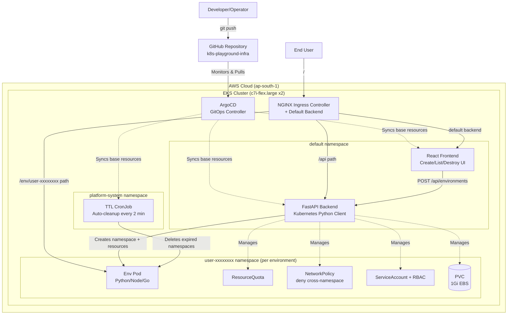

# Kubernetes Playground as a Service

## Introduction

This repository contains a complete, end-to-end cloud-native platform that provisions **temporary, isolated Kubernetes environments on demand** through a web UI similar in spirit to Gitpod, KodeKloud, or Katacoda. A user clicks "Create Environment," and the platform automatically provisions a dedicated Kubernetes namespace with its own Deployment, Service, PVC, NetworkPolicy, RBAC, and Ingress route then tears it down automatically after a TTL expires. The project combines Terraform (infrastructure), Kubernetes (workload orchestration), ArgoCD (GitOps), and a FastAPI + React application layer into a single automated pipeline.

---

## Architecture Diagram



- **Traffic Flow:**

1. **Developer** pushes Terraform, Kubernetes manifests, and application code to GitHub.
2. **ArgoCD** monitors the `k8s-playground-infra` repository and syncs base cluster resources (RBAC, Deployments, Ingress) automatically, with self-healing enabled.
3. **User** visits the platform URL, which routes through **NGINX Ingress** to the **React frontend** (configured as the Ingress controller's default backend).
4. On clicking "Create Environment," the frontend calls the **FastAPI backend** at `/api/environments`, which uses the Kubernetes Python client to provision an isolated namespace with a Deployment, Service, PVC, ResourceQuota, NetworkPolicy, ServiceAccount+RBAC, and a per-user Ingress rule.
5. The user is given a path-based URL (`LB_URL/env/user-xxxxxxxx`) which NGINX routes directly to their pod.
6. A **TTL CronJob** running in `platform-system` checks every 2 minutes for expired namespaces and deletes them automatically, reclaiming cluster resources.

---

## Tech Stack

* **Cloud Provider:** AWS (EKS `c7i-flex.large` managed node group, 2 nodes, region `ap-south-1`)
* **Infrastructure as Code:** Terraform (VPC, EKS, EBS CSI driver via OIDC/IRSA)
* **Configuration Management:** Ansible (NGINX Ingress, TTL controller, ArgoCD, New Relic install)
* **Continuous Deployment (GitOps):** ArgoCD (self-healing sync from Git)
* **Ingress / Routing:** NGINX Ingress Controller (path-based routing, no wildcard DNS required)
* **Backend:** FastAPI + Kubernetes Python client
* **Frontend:** React
* **Monitoring:** New Relic (Kubernetes infrastructure monitoring)
* **Container Registry:** AWS ECR

---

## Repository Structure

* `terraform/` : Terraform configuration for VPC, EKS cluster, and EBS CSI driver.
* `ansible/` : Ansible playbook to install NGINX Ingress, TTL controller, ArgoCD, and New Relic.
* `manifests/` : Kubernetes manifests — `api-rbac.yaml`, `app-deployment.yaml`, `ttl-controller.yaml`, `argocd-app.yaml`.
* `api/` : FastAPI backend source (`main.py`), `Dockerfile`, `requirements.txt`.
* `frontend/` : React frontend source (`src/App.js`), `Dockerfile`, `nginx.conf`.
* `k8s-playground-infra/` (separate repo): GitOps source of truth synced by ArgoCD contains `base/` manifests.
* `screenshots/` : Architecture diagrams and screenshots.
* `README.md` : Project documentation.

---

## Steps to Deploy

### Step 1: Provision Infrastructure
Run `terraform apply` from the `terraform/` directory to provision the VPC, EKS cluster (2x `c7i-flex.large` nodes), and EBS CSI driver via OIDC.

### Output

```bash
terraform apply
```


After provisioning, configure kubectl and verify the cluster.

```bash
aws eks update-kubeconfig --region ap-south-1 --name playground-cluster
kubectl get nodes
kubectl get nodes -o wide
```


### Step 2: Connect kubectl and Verify Cluster
Update your kubeconfig to point at the new EKS cluster and confirm both nodes are `Ready`.


### Step 3: Install NGINX Ingress, TTL Controller, and New Relic via Ansible
Run the Ansible playbook to install the NGINX Ingress Controller, apply the TTL CronJob, and install New Relic monitoring.

### Output

```bash
cd ansible
ansible-playbook install.yml
```


### Step 4: Install and Configure ArgoCD
Create the `argocd` namespace, install ArgoCD, retrieve the admin password, and access the UI via port-forward.

### Screenshots


### Step 5: Apply RBAC and Deploy Application Manifests
Apply `api-rbac.yaml` (ClusterRole/ClusterRoleBinding for the API's Kubernetes permissions) and `app-deployment.yaml` (API + frontend Deployments, Services, and the API's Ingress).

Check the output of `kubectl get pods` showing `playground-api` and `playground-frontend` pods in `Running` state.

### Step 6: Configure NGINX Default Backend
Patch the `ingress-nginx-controller` Deployment to set the React frontend as the default backend, so any unmatched request routes to the UI automatically.

Check the output for confirming the `kubectl patch deployment ingress-nginx-controller` command succeeded and the controller rolled out.

### Step 7: Access the Platform and Create an Environment
Open the Load Balancer URL in a browser, use the UI to create a new environment, and open the resulting environment link.

### UI


### Environment


### Verification

```bash
kubectl get ns
```


### Monitoring


### Step 8: Verify TTL Auto-Cleanup
Wait for an environment's TTL to expire (or shorten it for testing) and confirm the TTL CronJob deletes the namespace automatically.

`kubectl get cronjob -n platform-system` and `kubectl get ns`


## Summary
This project demonstrates a full "Playground-as-a-Service" platform built on real Kubernetes primitives namespace isolation, RBAC, NetworkPolicies, ResourceQuotas, and dynamic Ingress routing all provisioned through Infrastructure as Code and managed via GitOps. It bridges cloud infrastructure automation with practical multi-tenant Kubernetes patterns, without any manual cluster intervention after initial setup.

---

## Credits
This project was independently developed by **Tanmay Kakulte**, with support from **Claude AI** for documentation, debugging, and best-practice recommendations.